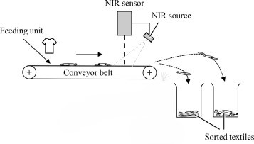

# Textile Sorting with NIRSCAN

This project focuses on sorting textiles using Near-Infrared (NIR) scanning technology.

## Table of Contents
- [Introduction](#introduction)
- [Features](#features)
- [Installation](#installation)
- [Usage](#usage)
- [Contributing](#contributing)
- [License](#license)

## Introduction
Textile sorting is a crucial step in recycling and waste management. This project utilizes NIR scanning to identify and sort different types of textiles efficiently.



## Features
- Accurate textile identification
- Efficient sorting mechanism
- Easy integration with existing systems

## Installation
To install the necessary dependencies, run:
```bash
pip install -r requirements.txt
```

## Usage
To start the textile sorting process, use the following command:
```bash
python sort_textiles.py
```

## Contributing
We welcome contributions! Please read our [contributing guidelines](CONTRIBUTING.md) for more details.

## License
This project is licensed under the MIT License. See the [LICENSE](LICENSE) file for details.


